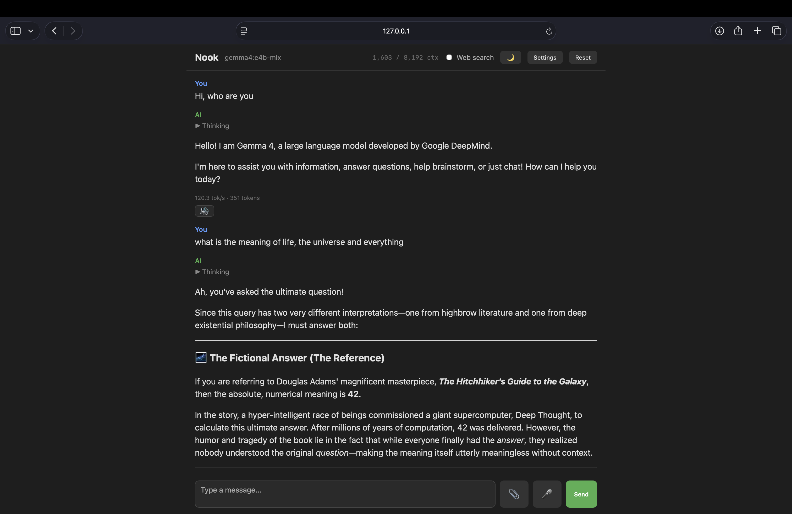

# Nook

A self-hosted, local-first chat UI for [Ollama](https://ollama.com). Everything
runs on your machine — chat, voice input, spoken replies, image/document
understanding — with no data leaving your computer unless you turn on web
search.



## Why
If you run local models via Ollama, you can chat with the models via the Ollama GUI or the CLI, but neither renders markdown properly or tells you token speed and usage - so this is mainly for my own use to make life easier.

If you're using something like Gemma4, it has tools - like web search - but you have to set it up. In Nook you can just check the Web search box and it will use a web search if it needs some updated info.

You can change system prompt, context window, model temperature and more from settings.

## Features

- **Streaming chat** with any model you have pulled in Ollama, including live
  "thinking" output for reasoning models
- **Voice input** — speak your prompt, transcribed locally with
  [faster-whisper](https://github.com/SYSTRAN/faster-whisper)
- **Spoken replies** — either your browser's built-in TTS, or a natural local
  neural voice via [Kokoro](https://github.com/thewh1teagle/kokoro-onnx)
- **Vision support** — attach images to models that support them
- **Web search & fetch tools** — let the model search the web and read pages
  when it needs current information (requires an Ollama account, see
  [Configuration](#configuration))
- **Performance & context stats** — each reply shows generation speed
  (tokens/sec) and token count, and the header tracks how much of the
  model's context window has been used so far (e.g. `1,603 / 8,192 ctx`),
  with a warning if a reply gets cut off from hitting the max output tokens
- **Mermaid diagram rendering** and full Markdown formatting in responses
- **Settings panel** for model choice, system prompt, sampling parameters,
  context window, and TTS engine — all editable from the UI, no restart
  required
- **Auto-detected model list** — the model dropdown is populated straight
  from `ollama list`, so any model you've pulled shows up automatically
- Light/dark theme

## Prerequisites

- [Ollama](https://ollama.com/download) installed and running, with at least
  one model pulled, e.g.:
  ```bash
  ollama pull gemma3:12b
  ```
- Python 3.12+
- [uv](https://docs.astral.sh/uv/) for dependency management

## Setup

```bash
git clone <your-repo-url> nook
cd nook
uv sync
cp .env.example .env
```

Then run it:

```bash
uv run app.py
```

Open **http://localhost:5050**.

On first use, two things download automatically in the background: a
Whisper transcription model (~150MB) and, if you switch to the Kokoro voice
in Settings, a ~170MB TTS model. Both are cached under `~/.cache` afterward.

## Configuration

Settings can be changed live from the ⚙️ Settings panel in the UI — model,
system prompt, temperature/top-p/top-k/repeat penalty, context window, max
output tokens, and TTS engine. These persist to `config.json`, which is
created automatically with sane defaults on first save (see
`config.example.json` for the shape).

`.env` holds `OLLAMA_API_KEY`, which is **only** needed if you want to use
Ollama's hosted cloud models or the built-in web search/fetch tools — a
purely local setup with local models doesn't need it. Get a key from your
[Ollama account](https://ollama.com) if you want that.

## How it's built

- **Backend**: Flask (`app.py`), talking to Ollama over its Python client,
  streaming responses via Server-Sent Events
- **Frontend**: vanilla JS/CSS (`static/`), no build step, using vendored
  copies of [marked](https://github.com/markedjs/marked) (Markdown),
  [DOMPurify](https://github.com/cure53/DOMPurify) (sanitization), and
  [Mermaid](https://github.com/mermaid-js/mermaid) (diagrams)
- **Speech-to-text**: faster-whisper, running locally on CPU
- **Text-to-speech**: Kokoro (local ONNX model) or the browser's own
  `speechSynthesis` API

`main.py` is a minimal, dependency-light terminal chat client kept as a
reference for anyone who wants the core streaming loop without the web app.

## License

[MIT](LICENSE)
